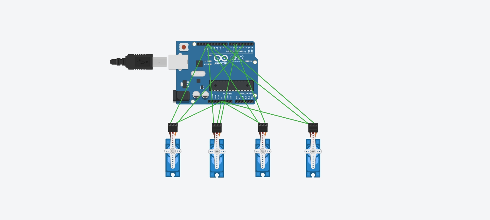
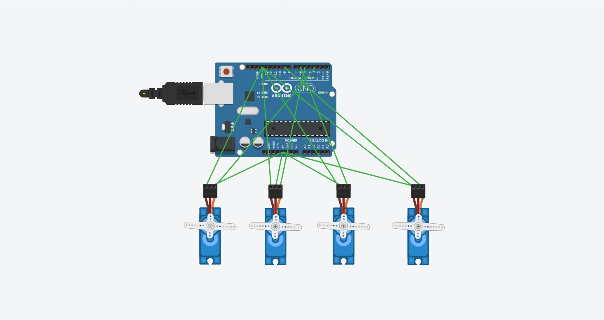

# Four-Servo-Arduino-Control

## Overview
This project demonstrates how to control four servo motors simultaneously using an Arduino Uno and the Servo library. The circuit was designed and simulated using Tinkercad.

## Components
- Arduino Uno
- 4× Micro Servo Motors
- Jumper Wires

## Pin Connections

| Servo | Arduino Pin |
|--------|-------------|
| Servo 1 | D3 |
| Servo 2 | D5 |
| Servo 3 | D6 |
| Servo 4 | D9 |

All servo motors share:
- **5V → Arduino 5V**
- **GND → Arduino GND**

## Project Behavior
- All four servo motors perform the Servo Sweep example simultaneously.
- The sweep runs for approximately **2 seconds**.
- After completing the sweep, all servo motors stop and hold at **90°**.

## Files
- `Four_Servo_Sweep.ino` – Arduino source code.
- `Circuit_Before_Run.jpeg` – Circuit before simulation.
- `Circuit_During_Sweep.jpeg` – Circuit during the sweep simulation.

## Circuit Images

### Before Running

### During Sweep

## Tinkercad Circuit

[Tinkercad Project](https://www.tinkercad.com/things/1I2BqvcHik6/editel)

## Author

**Feras Alzahrani**
